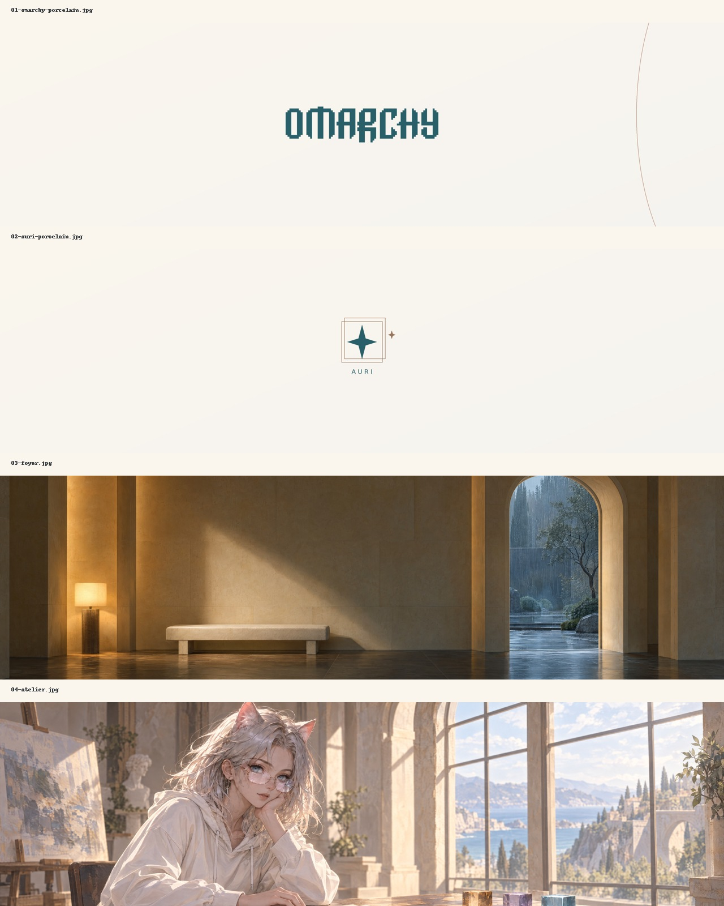

# Auri Light

The daylight sibling of [Auri](https://github.com/JSRRosenbaum/omarchy-auri-theme): warm porcelain surfaces, ink text, ocean-blue focus, brushed rose-gold and muted plum accents. Designed as a light palette, not an inversion filter.



## Install without switching

```sh
git clone https://github.com/JSRRosenbaum/omarchy-auri-light-theme.git ~/.config/omarchy/themes/auri-light
```

Select **Auri Light** from Omarchy's theme menu when ready, or run `omarchy theme set auri-light`. Record the old name with `omarchy theme current`; switch back with `omarchy theme set "Previous Theme"`. Cloning does not activate anything. Existing destinations are not overwritten.

## Design and compatibility

Targets the semantic `colors.toml` contract in Omarchy 4.0.0.alpha. All app configurations come from installed upstream templates. No executable hooks, custom layout, fonts, or editor plugins are shipped. Both `mode = "light"` and the compatibility `light.mode` marker are supplied. Stock GNOME integration selects Adwaita (light); icon colors use the upstream fallback.

Warm near-white backgrounds and darker, chromatic ANSI colors preserve readable terminals. Bright ANSI names are semantic terminal slots, not an instruction to make unreadable pale text. ANSI black remains the background by upstream contract; use bright black/muted for visible neutral text. See VALIDATION.md for measured contrast and renderer checks, including limitations. No live desktop screenshot or smoke test is claimed.

## Four wallpapers

- **Omarchy Porcelain**: genuine upstream wordmark in ocean ink on a locally rendered ivory field, restrained rose-gold arc.
- **Auri Porcelain**: locally drawn vector-like star and offset-square emblem; no AI regeneration or image inversion.
- **Foyer** and **Atelier**: existing Sunburst Max artwork, reused unchanged. These are the warm architectural/character alternatives; the logos are the quieter choices. Atelier remains a tight panoramic portrait crop.

All are 5120×1440 (32:9). Logo wallpapers are rendered at final dimensions. Scene originals were generated at 3840×1280, cropped and upscaled—not native 5K. No new image API spend was incurred for this variant. The original dark Auri collection remains independent.

Omarchy logo attribution and upstream license are retained in `credits/`. No official endorsement or blanket license to third-party marks is implied.
